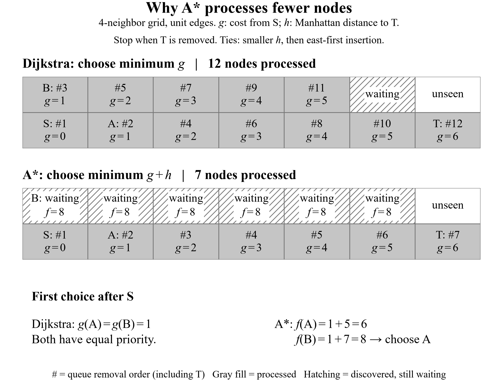
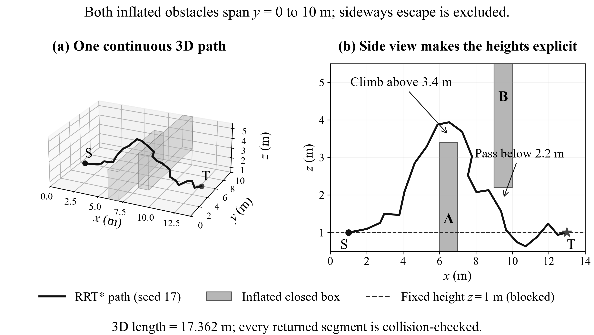
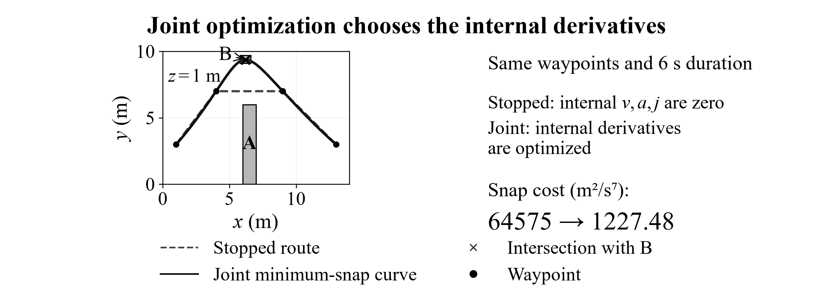

# UAV Planning Book Examples

[中文说明](README_ZH.md)

For the IET book maintainer: [Chapter 4 integration and update commands](docs/integration.md).

Python and C++ examples accompanying the UAV planning chapter. The first set covers
Sections **4.2.1–4.2.8** and **4.3.1–4.3.2**, including grid search, incremental
replanning, sampling, motion primitives and polynomial trajectories.

## Choose an example

| Book sections | Topic | Python entry point | C++ source |
| --- | --- | --- | --- |
| 4.2.1–4.2.4 | Dijkstra, A*, Weighted A*, Theta*, shortcutting, D* Lite | `Chapter_4.2_Code/chapter_examples.py` | `planning.cpp` |
| 4.2.5–4.2.6 | PRM, RRT, RRT*, kinodynamic A* | `Chapter_4.2_Code/run_sampling.py` | `sampling_dynamics.cpp` |
| 4.2.7–4.2.8 | Moving-agent replanning and 3D sampling | `Chapter_4.2_Code/run_simulations.py` | `simulations.cpp` |
| 4.3.1–4.3.2 | Polynomial interpolation and minimum snap | `Chapter_4.3_Code/run_trajectory.py` | `trajectory_generation.cpp` |

All paths in this table are relative to `examples/chapter04/`. The chapter's JPS
discussion currently has no executable implementation. See [section mapping](docs/book_sections.md).

## Python quick start

Use **Python 3.12 or later** for the pinned dependencies. Open a terminal in the
repository root. On Windows PowerShell:

```powershell
py -3.12 -m venv .venv
.\.venv\Scripts\python -m pip install -r requirements.txt
.\.venv\Scripts\python examples/chapter04/Chapter_4.2_Code/chapter_examples.py
.\.venv\Scripts\python examples/chapter04/Chapter_4.3_Code/run_trajectory.py
.\.venv\Scripts\python tools/run_checks.py
```

On Linux or macOS:

```bash
python3 -m venv .venv
.venv/bin/python -m pip install -r requirements.txt
.venv/bin/python examples/chapter04/Chapter_4.2_Code/chapter_examples.py
.venv/bin/python examples/chapter04/Chapter_4.3_Code/run_trajectory.py
.venv/bin/python tools/run_checks.py
```

The grid, sampling and replanning algorithms themselves use the Python standard
library. Polynomial optimization needs NumPy; figure generation needs Matplotlib.
These examples run without ROS or a separate flight simulator.

## Figures and recorded results

Each example folder contains numerical `results/`, English PNG figures and editable
SVG sources in `visual_figures/`. See its README for figure-generation commands.
Publication plots require an installed **Times New Roman** font. The existing PNGs
can be viewed directly without installing that font.







## C++ quick start

Install CMake 3.16 or later and a C++17 compiler. From the repository root:

```text
cmake -S . -B build
cmake --build build --config Release --parallel
ctest --test-dir build -C Release --output-on-failure
```

Four executables are built: `grid_planning`, `sampling_dynamics`, `simulations`,
and `trajectory_generation`. With Visual Studio they are under `build/Release/`;
with a single-configuration generator they are under `build/`. The programs also
support `--self-test`; see the chapter folders for direct compiler commands.

GitHub Actions runs the existing Python checks and C++ self-tests on Windows and
Linux for each push and pull request.

## Reproduction scope

The cases use fixed scene geometry, parameters and seeds. They demonstrate the
specified geometric or reduced translational models. See
[reproduction details](docs/reproducibility.md) for result interpretation and
[external projects](docs/external_projects.md) for later EGO-Planner-v2,
EGO-Swarm, Fast-Planner and learning cases. Those integrations will be added as
their book sections are completed and their environments are verified.

Figures are designed for **black and white printing**. Line styles, point markers
and hatching carry meaning, so the examples remain readable without color.
The SVGs retain editable English Times New Roman text and geometry.
